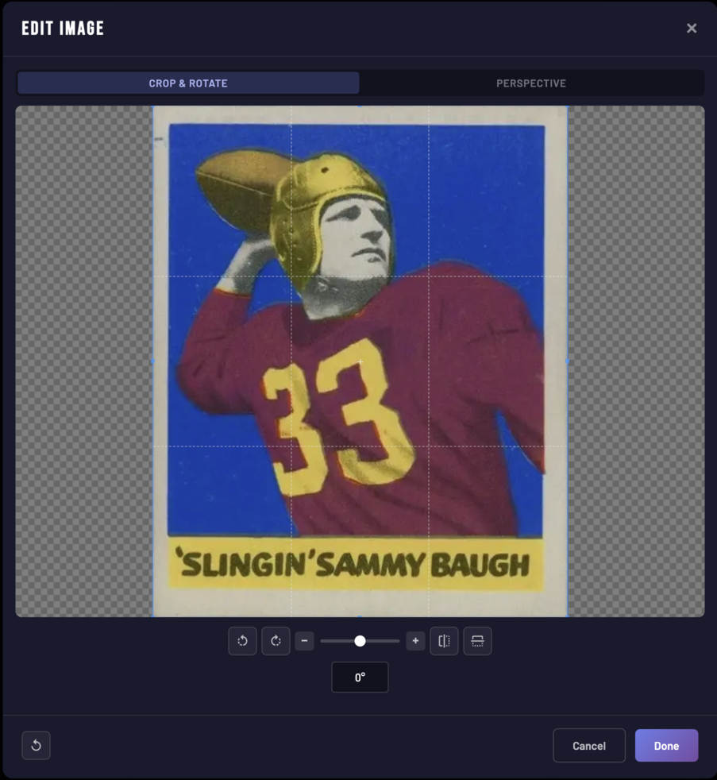
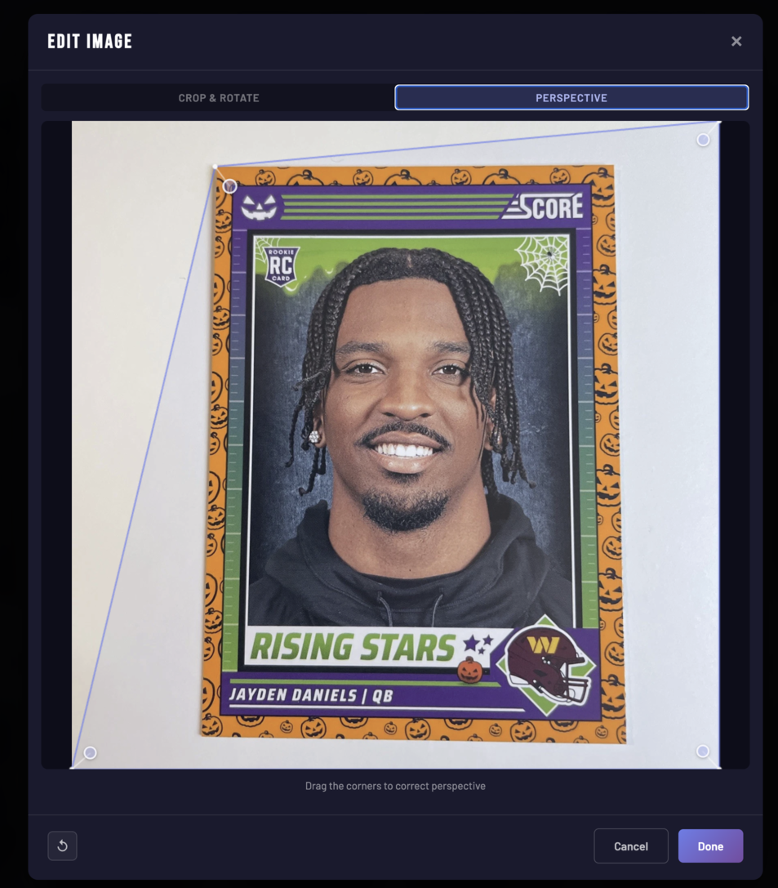
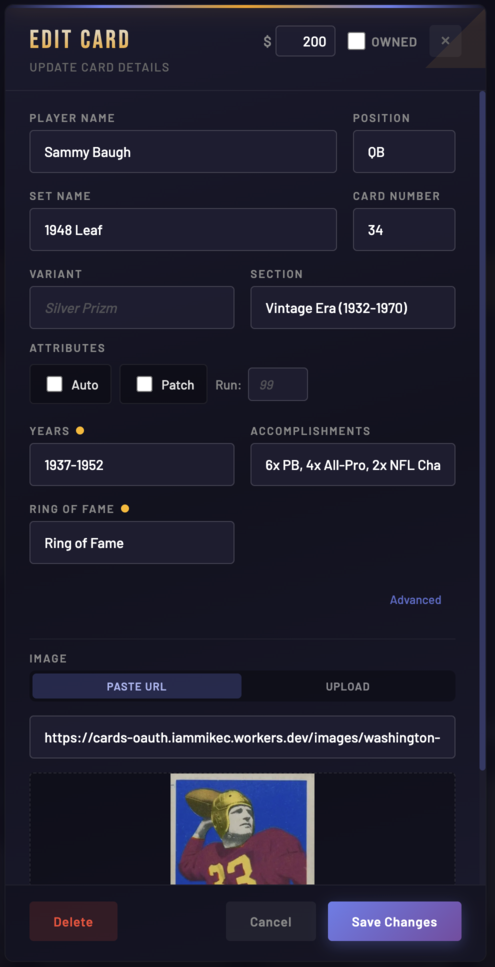
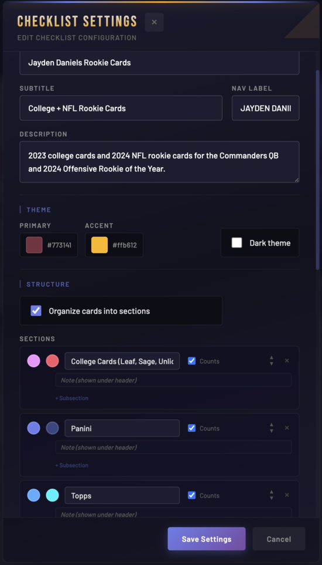

# Sports Card Checklists

A modern web app for tracking sports card collections with cloud sync, real-time stats, and inline editing.

**Live site: [iammike.github.io/sports-card-checklists](https://iammike.github.io/sports-card-checklists/)**

  

<table>
<tr>
<td width="50%">
<p align="center"><strong>Image Editor - Crop & Rotate</strong></p>

</td>
<td width="50%">
<p align="center"><strong>Image Editor - Perspective Correction</strong></p>

</td>
</tr>
<tr>
<td>
<p align="center"><strong>Card Editor</strong></p>

</td>
<td>
<p align="center"><strong>Checklist Configuration</strong></p>

</td>
</tr>
</table>

## Features

### Collection Tracking
- **Checkbox-based ownership** - Mark cards as owned with a single click
- **Progress tracking** - See owned/total counts and completion percentage
- **Manual pricing** - Record purchase prices on individual cards

### Cloud Sync
- **GitHub OAuth authentication** - Secure login via GitHub
- **Gist-based storage** - Collection data synced to public GitHub Gist
- **Cross-device sync** - Access your collection from any device
- **Public viewing** - Visitors can view your collection (read-only)
- **CSRF protection** - Secure OAuth flow with state parameter validation

### Filtering & Search
- **Status filter** - Show all, owned only, or needed cards
- **Text search** - Find cards by name, set, or any text
- **Sort options** - Sort by year, set name, serial number, price

### Inline Editing (Owner Only)
- **Add new cards** - Add cards directly from the UI
- **Edit card details** - Right-click or long-press to edit any card
- **Delete cards** - Remove cards with confirmation
- **Schema-driven forms** - Custom fields per checklist type

### Image Tools (Owner Only)
- **Tab-based image editor** - Perspective correction and crop/rotate in a single editor (powered by Cropper.js)
- **Edit existing images** - Re-edit previously saved images with one click
- **Fine rotation** - Slider plus +/- buttons for precise straightening (0.5 increments)
- **Local file upload** - Upload images from your computer via button or drag & drop
- **Multiple sources** - Fetch images from eBay or Beckett listings
- **Auto-processing** - Images automatically resized and converted to WebP on save
- **Cloudflare R2 storage** - Images uploaded instantly, no git involvement

### UI/UX
- **Animated stats** - Numbers count up on first load
- **Collapsible sections** - Click section headers to expand/collapse
- **Auto-hiding sections** - Empty sections automatically hidden
- **Responsive design** - Works on desktop and mobile
- **Print-friendly** - Clean layout for printing checklists
- **Direct eBay links** - One-click search for any card
- **Price guide links** - Quick access to price lookups

## Checklists

All checklists are config-driven and managed via the gist registry. Browse them on the **[live site](https://iammike.github.io/sports-card-checklists/)**.

## Architecture

```
                              ┌──────────────────┐
                              │   GitHub Pages   │
                              │   (Hosting)      │
                              └────────┬─────────┘
                                       │
                              ┌────────▼─────────┐
                              │   checklist.html  │
                              │   + engine JS     │
                              │   (config-driven) │
                              └────────┬──────────┘
                                       │
          ┌────────────────────────────┼────────────────────────────┐
          │                            │                            │
          ▼                            ▼                            ▼
┌─────────────────┐         ┌─────────────────┐         ┌─────────────────┐
│ Cloudflare      │         │ Cloudflare R2   │         │ GitHub Gist     │
│ Workers (OAuth  │         │ (Image storage) │         │ (Collection +   │
│  + image proxy) │         │                 │         │  config storage) │
└─────────────────┘         └─────────────────┘         └─────────────────┘
```

### Key Components

| File | Purpose |
|------|---------|
| `checklist.html` + `checklist-engine.js` | Config-driven checklist page (loads via `?id=xxx`) |
| `shared.js` | Shared components (CardEditorModal, CardRenderer, ChecklistManager, ImageProcessor, etc.) |
| `shared.css` | All shared styles |
| `github-sync.js` | OAuth flow, Gist CRUD, R2 image upload, GitHub API integration |
| `worker.js` | Cloudflare Worker for OAuth, image proxy, and R2 image upload/serve |
| `index.html` | Landing page with dynamic checklist cards from gist registry |

### Security Features

- **OAuth proxy** - Client secret never exposed to browser
- **CORS restrictions** - Worker only accepts requests from allowed origins
- **CSRF protection** - State parameter validation on OAuth callback
- **XSS prevention** - All user content sanitized before rendering
- **URL validation** - Only allowed protocols and domains

## Development

### Local Development
```bash
./serve.sh
# or
python3 -m http.server 8000
```

Then open http://localhost:8000

Note: Auth and gist data require the deployed domain. Local dev is useful for CSS/layout work only.

### Running Tests
```bash
npm test        # run once
npm run test:watch  # watch mode
```

Tests use vitest with jsdom and cover sanitization, card rendering, and search term generation.

### Preview Deployments

Cloudflare Pages preview deployments allow testing changes without affecting production:
- Branch previews at `<branch>.sports-card-checklists.pages.dev`
- Isolated data storage (changes don't affect production gist)

### Adding New Checklists

Checklists are config-driven and stored entirely in the GitHub Gist:

1. Log in on the live site
2. Use the "Create Checklist" button to set up a new config (`{id}-config.json`)
3. Add cards through the inline card editor (saved to `{id}-cards.json`)
4. The checklist automatically appears on the index page via `checklists-registry.json`

No code changes needed to add a new checklist.

### Project Structure
```
├── index.html               # Landing page (loads checklists from gist registry)
├── checklist.html           # Config-driven checklist page (?id=xxx)
├── checklist-engine.js      # Checklist engine (loads config from gist)
├── github-sync.js           # OAuth + Gist + R2 storage
├── shared.js                # Shared utilities and components
├── shared.css               # Shared styles
├── worker.js                # Cloudflare Worker (deploy separately)
├── wrangler.toml            # Cloudflare Worker config (R2 binding)
├── tests/                   # Unit tests (vitest)
└── scripts/                 # Maintenance/migration scripts (gitignored)
```

## Tech Stack

- **Frontend**: Vanilla JavaScript (no frameworks)
- **Hosting**: GitHub Pages (production), Cloudflare Pages (preview)
- **Auth**: GitHub OAuth via Cloudflare Workers
- **Storage**: GitHub Gists (JSON config + card data)
- **Images**: Cloudflare R2, WebP format, processed client-side
- **Testing**: Vitest with jsdom
- **CI/CD**: GitHub Actions for Worker deploys

## License

MIT
